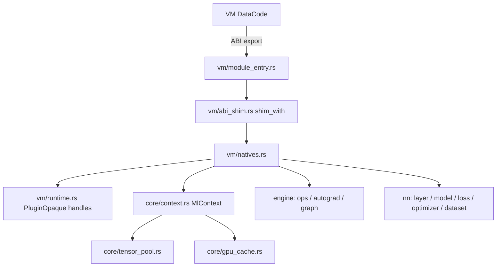

# Архитектура `ml` (DataCode)

Крейт `ml` собирается как `rlib` + `cdylib` (`libml.dylib` / `libml.so` / `ml.dll`) и подключается VM как нативный модуль `import ml`.

Исходники сгруппированы по слоям под `src/`. **Публичные пути модулей не менялись** (`ml::tensor`, `ml::graph`, …): реализации лежат в подпапках, а `src/lib.rs` подключает их через `#[path = "..."]`.

## Слои и папки

| Слой | Папка | Назначение |
|------|--------|------------|
| **VM / ABI** | [`src/vm/`](src/vm/) | Мост VM ↔ dylib: `vm_value`, `abi_shim`, `plugin_abi_bridge`, `module_entry`, `natives`, `runtime`, типы хэндлов (`ml_types`, `plugin_opaque`), ошибки нативов |
| **Core** | [`src/core/`](src/core/) | Тензоры, устройство, контекст выполнения, пулы/кэш, реестр бэкендов, пути к датасетам |
| **Engine** | [`src/engine/`](src/engine/) | Операции над тензорами, автоград, вычислительный граф |
| **NN** | [`src/nn/`](src/nn/) | Датасеты, слои, модели, лоссы, оптимизаторы, LR scheduler |
| **GPU** | [`src/gpu/`](src/gpu/) | Candle / GPU-операции (feature `gpu`) |

## Поток данных (VM → ML)

## Карта модулей (`ml::...`)

| Крейт-модуль | Файл |
|--------------|------|
| `ml::tensor` | `src/core/tensor.rs` |
| `ml::device` | `src/core/device.rs` |
| `ml::context` | `src/core/context.rs` |
| `ml::tensor_pool` | `src/core/tensor_pool.rs` |
| `ml::gpu_cache` | `src/core/gpu_cache.rs` |
| `ml::backend_registry` | `src/core/backend_registry.rs` |
| `ml::mnist_paths` | `src/core/mnist_paths.rs` |
| `ml::ops` | `src/engine/ops.rs` |
| `ml::autograd` | `src/engine/autograd.rs` |
| `ml::graph` | `src/engine/graph.rs` |
| `ml::dataset` | `src/nn/dataset.rs` |
| `ml::layer` | `src/nn/layer.rs` |
| `ml::model` | `src/nn/model.rs` |
| `ml::loss` | `src/nn/loss.rs` |
| `ml::optimizer` | `src/nn/optimizer.rs` |
| `ml::scheduler` | `src/nn/scheduler.rs` |
| `ml::ops_gpu` | `src/gpu/ops_gpu.rs` (feature `gpu`) |
| `ml::ml_types` | `src/vm/ml_types.rs` |
| `ml::runtime` | `src/vm/runtime.rs` |
| `ml::natives` | `src/vm/natives.rs` |
| `ml::plugin_opaque` | `src/vm/plugin_opaque.rs` |
| Внутренние: `vm_value`, `plugin_abi_bridge`, `abi_shim`, `module_entry` | `src/vm/*.rs` |
| `candle_integration` | `src/gpu/candle_integration.rs` (feature `gpu`, private) |

## Прочее в репозитории

- [`compiler/`](compiler/) — JSON с именами параметров для компилятора DataCode; crate [`crates/datacode_ml_compiler`](crates/datacode_ml_compiler/) встраивает этот JSON.
- [`examples/`](examples/) — примеры скриптов `.dc`.
- [`datasets/mnist/`](datasets/mnist/) — IDX-файлы MNIST (пути через `ml::mnist_paths`).

## Зависимости

- `datacode_abi` / `datacode_sdk` — локальные пути в этом репозитории. Типы модуля (`DatacodeModule` с `export_table` + `register`, `PluginOpaque` в `AbiValue` и т.д.) должны **совпадать** с копией ABI в основном репозитории DataCode VM, иначе загрузка `libml` из VM даст UB при чтении дескриптора.
- Опционально `data-code` (feature `data-code-table`) и **dev-dependency** для интеграционных тестов — путь задаётся в [`Cargo.toml`](Cargo.toml) (соседний checkout `../DataCode` рядом с этим репозиторием; раньше использовался `../..` для вложенного `ml` внутри дерева DataCode).
